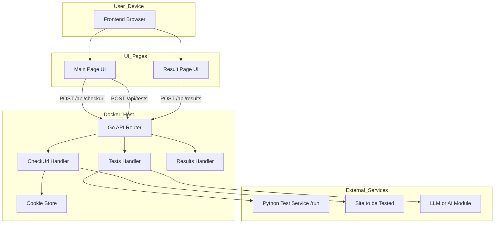

### Deployment view

```mermaid
flowchart TD
    subgraph User_Device
        browser[Frontend Browser]
    end

    subgraph Docker_Host
        router[Go API Router]
        checkHandler[CheckUrl Handler]
        testHandler[Tests Handler]
        resultsHandler[Results Handler]
        cookie[Cookie Store]
    end

    subgraph External_Services
        pythonAPI[Python Test Service /run]
        targetSite[Site to be Tested]
        llm[LLM or AI Module]
    end

    subgraph UI_Pages
        mainPage[Main Page UI]
        resultPage[Result Page UI]
    end

    browser --> mainPage
    mainPage -->|POST /api/checkurl| router
    router --> checkHandler
    checkHandler --> targetSite
    checkHandler --> cookie

    mainPage -->|POST /api/tests| router
    router --> testHandler
    testHandler --> pythonAPI
    testHandler --> llm

    browser --> resultPage
    resultPage -->|POST /api/results| router
    router --> resultsHandler
```
