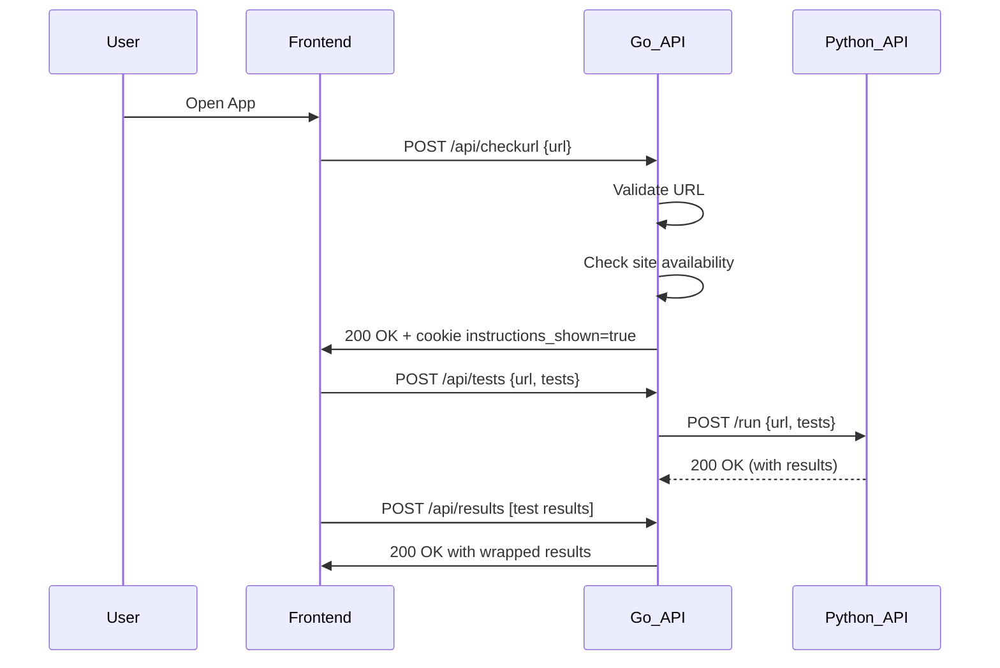

### Dynamic view
###  Sequence Diagram

```mermaid
sequenceDiagram
    participant User
    participant Frontend
    participant Go_API
    participant Python_API

    User->>Frontend: Open App
    Frontend->>Go_API: POST /api/checkurl {url}
    Go_API->>Go_API: Validate URL
    Go_API->>Go_API: Check site availability
    Go_API->>Frontend: 200 OK + cookie instructions_shown=true

    Frontend->>Go_API: POST /api/tests {url, tests}
    Go_API->>Python_API: POST /run {url, tests}
    Python_API-->>Go_API: 200 OK (with results)

    Frontend->>Go_API: POST /api/results [test results]
    Go_API->>Frontend: 200 OK with wrapped results
```
