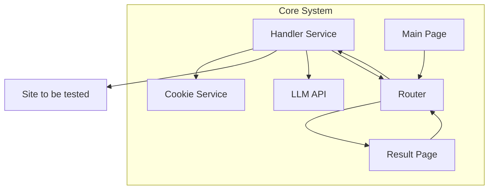

```mermaid
flowchart TB

    ST[Site to be tested]

    subgraph Core System
        CK[Cookie Service]
        HS[Handler Service]
        LLM[LLM API]
        RT[Router]
        MP[Main Page]
        RP[Result Page]
    end


    MP --> RT
    RP --> RT
    RT --> HS
    HS --> CK
    HS --> ST
    HS --> LLM
    HS --> RT
    RT --> RP

```
